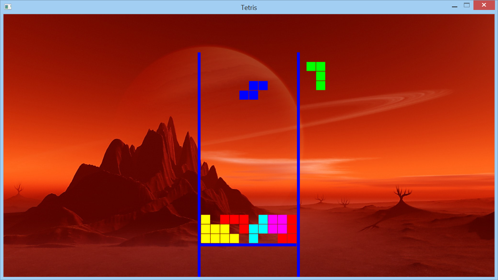

# Tetris 
Tetris game for linux (originally made for windows enviroment [here](https://github.com/abesary/tetris)) in C++ using SDL2 (SDL2 Library included in repository

You'll need libsdl-gfx1.2-dev and libsdl1.2-dev to use SDL on linux. If you are using Ubuntu you can get them this way: 
```
sudo apt-get install libsdl2-dev 
sudo apt-get install libsdl2-gfx-dev
```

Next, clone source code and compile with
```
make
```

Finaly, run the program
```
./Tetris
```
### Game Play
arrow keys - move piece

space      - drops piece

### Screenshot


ENJOY!


